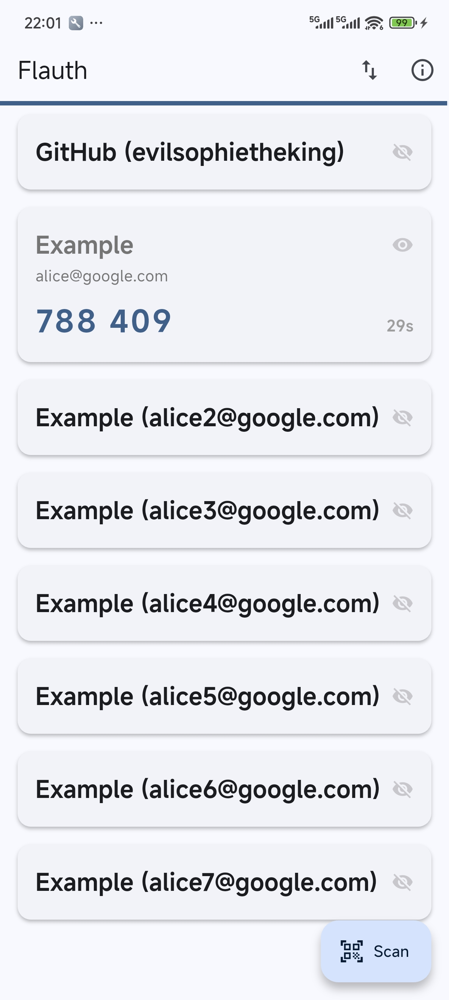
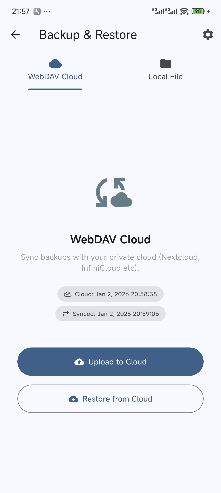

# Flauth 🔐

[中文说明](./README_zh.md)

<div align="center">

</div>

> Flauth is a privacy-first, fully open-source TOTP authenticator for Android, macOS, Windows, and Linux.

It provides a simple and lightweight solution for managing your 2FA (Two-Factor Authentication) tokens.

## 🌟 Why Flauth?

- **100% Open Source**: Transparent and trustable code. Your secrets never leave your device unless you choose to sync them.
- **Flexible Backups**:
  - **Security Logic**: Detailed [backup and restore mechanisms](./docs/backup.md).
  - **Local Backup**: Export/Import accounts as standard text files using system file pickers.
  - **WebDAV Sync**: Seamlessly sync your data with your private cloud (Nextcloud, Nutstore, etc.) using a robust single-file sync approach with custom path support.
- **Privacy & Security**:
  - **Security Architecture**: Detailed [security implementation and authentication strategies](./docs/auth.md).
  - **Performance Design**: Detailed [high-frequency UI update optimizations](./docs/perf.md).
  - **Encrypted Storage**: Secrets are encrypted and stored in the device's secure element (Keychain on iOS/macOS, Keystore on Android).
  - **Granular Storage**: Implements "One Key Per Account" architecture for maximum reliability and scalability.
- **Modern UI**: Focused on simplicity. Built with Material 3, supporting adaptive light and dark modes.

## 📸 Screenshots

<div align="center">



</div>


## 📥 Importing from other apps

Migrating to Flauth is easy thanks to its support for standard `otpauth://` URIs:

- **[Importing from Aegis](./docs/import_aegis.md)**: A step-by-step guide to migrate all your accounts from Aegis Authenticator.
- **Manual Migration**: For other apps, export your accounts as a **plain text list of `otpauth://` URIs** (one per line). Save this file with a `.flauth` extension, then use the **Local File** import feature.
  ```text
  otpauth://totp/GitHub:user?secret=ABC...&issuer=GitHub
  otpauth://totp/Google:user@gmail.com?secret=XYZ...&issuer=Google
  ```

## ⬇️ Download

You can find the latest pre-compiled binaries for all supported platforms (Android APK, macOS, Linux, and Windows) on the **[GitHub Releases](https://github.com/jiacai2050/flauth/releases)** page.

### 💡 Which Android APK should I download?
- **arm64-v8a**: **(Recommended)** For most modern Android phones (64-bit).
- **armeabi-v7a**: For older 32-bit Android phones.
- **x86_64**: For Android emulators on PC.
- **universal**: **(All-in-one)** Works on any device. Choose this if you're unsure, though the file size is larger.

### ⚡️ For Users in China (Download Acceleration)
If you encounter slow download speeds from GitHub, you can use the [gh-proxy](https://gh-proxy.com/) service to accelerate the download.

## 🛠️ Development

### Prerequisites
- [Flutter SDK](https://docs.flutter.dev/get-started/install) installed.
- Appropriate development environment (Xcode for iOS/macOS, Android Studio for Android).
- CocoaPods for iOS/macOS dependencies:
  ```bash
  brew install cocoapods
  ```

### Build & Run

1. **Clone the repository**:
   ```bash
   git clone https://github.com/jiacai2050/flauth.git
   cd flauth
   ```

2. **Install dependencies**:
   ```bash
   flutter pub get
   ```

3. **Run the application**:
   ```bash
   flutter run
   ```

4. **Build for release**:
   ```bash
   flutter build apk      # Android
   flutter build macos    # macOS
   flutter build windows  # Windows
   flutter build linux    # Linux
   ```

### Quality & Standards

Run the following commands to ensure code quality:
```bash
flutter analyze        # Static analysis
flutter test           # Run unit tests
```

### 🔑 Android Signing
For details on how to configure app signing for production, see the [Android Signing Guide](docs/android-sign.md).

## 🏗️ Platform Specifics

### macOS
To build on macOS, ensure you have set up a **Development Team** in Xcode for code signing (required for Keychain access in Sandbox). The app includes entitlements for:
- Network Client (WebDAV)
- Camera (Scanning)
- Keychain Sharing (Secure Storage)
- User-Selected File Access (Local Backup)

Run the following command to remove the quarantine attribute if you encounter issues when launching the app:
```bash
xattr -rd com.apple.quarantine /Applications/Flauth.app
```

## 🛡️ Permissions

- **Camera**: To scan QR codes for adding accounts.
- **Local Storage/Network**: To backup/restore accounts locally or via WebDAV.

## 📄 License

This project is licensed under the [MIT License](./LICENSE).
