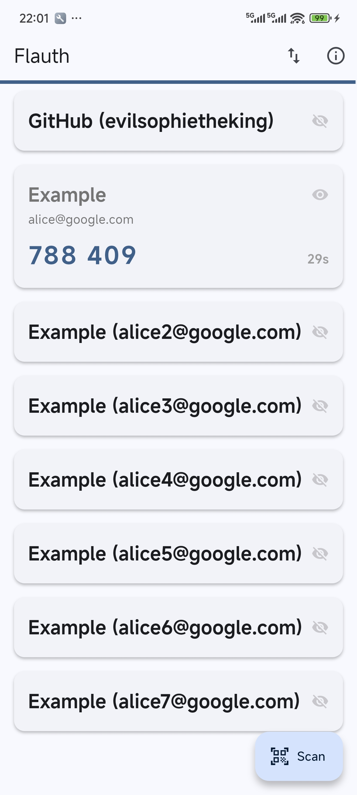
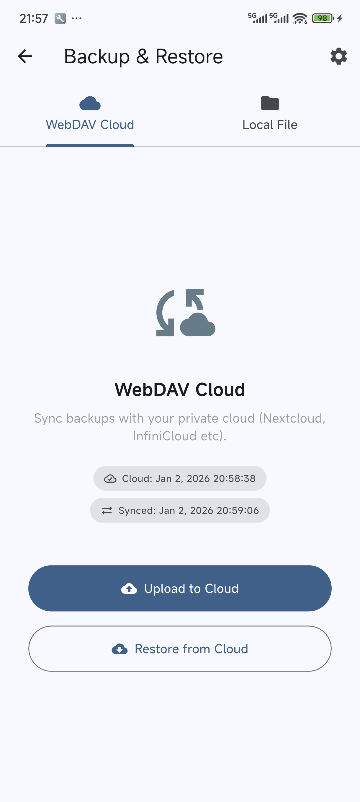
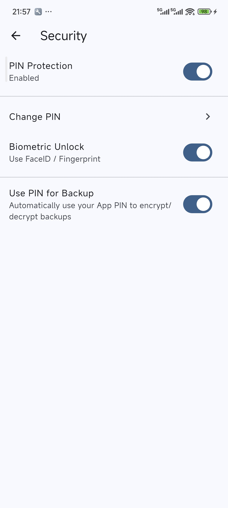

# Flauth 🔐

[English version](./README.md)

<div align="center">

</div>

> Flauth 是一款隐私优先、完全开源的 TOTP 身份验证器，支持 Android、macOS、Windows 和 Linux。

它为管理您的 2FA（双重身份验证）令牌提供了一个简洁轻量的解决方案。

## 🌟 为什么选择 Flauth？

- **完全开源**：代码透明可靠，您的密钥永远不会离开您的设备（除非您选择云同步）。
- **灵活的备份方案**：
  - **安全逻辑**：详细的[备份与恢复机制](./docs/backup_zh.md)。
  - **本地备份**：支持通过系统文件选择器将账号导出为标准的文本文件，或从本地文件导入。
  - **WebDAV 同步**：支持与您的私有云（如 Nextcloud、坚果云等）进行一键同步，支持自定义远程路径，简洁高效。
- **隐私与安全**：
  - **安全架构**：详细的[安全实现细节与认证策略](./docs/auth_zh.md)。
  - **性能设计**：详细的[高频 UI 更新优化方案](./docs/perf_zh.md)。
  - **加密存储**：密钥使用平台原生安全机制（iOS/macOS 的 Keychain，Android 的 Keystore）进行加密存储。
  - **颗粒化存储**：采用“一号一密 (One Key Per Account)”架构，提升数据读写性能与可靠性。
- **现代 UI**：极简设计，基于 Material 3，完美支持深色和浅色模式。

## 📸 截图预览

<div align="center">



</div>

## 📥 从其他应用导入

得益于对标准 `otpauth://` URI 的支持，迁移到 Flauth 非常简单：

- **[从 Aegis 导入](./docs/import_aegis_zh.md)**：分步指南，教您如何从 Aegis Authenticator 迁移所有账号。
- **手动迁移**：对于其他应用，请将其账号导出为**纯文本格式的 `otpauth://` URI 列表**（每行一个）。将该文件保存为 `.flauth` 后缀，然后使用“本地文件”导入功能。
  ```text
  otpauth://totp/GitHub:user?secret=ABC...&issuer=GitHub
  otpauth://totp/Google:user@gmail.com?secret=XYZ...&issuer=Google
  ```

## ⬇️ 下载安装

您可以在 **[GitHub Releases](https://github.com/jiacai2050/flauth/releases)** 页面找到所有支持平台（Android APK, macOS, Linux, Windows）的最新预编译安装包。

### 💡 我该下载哪个 Android 安装包？
- **arm64-v8a**：**（推荐）** 适用于近几年生产的绝大多数现代 64 位手机。
- **armeabi-v7a**：适用于较旧的 32 位手机。
- **x86_64**：适用于电脑上的 Android 模拟器。
- **universal**：**（通用版）** 包含所有架构。如果您不确定该选哪个，请选此版本（体积稍大）。

### ⚡️ 中国用户下载加速
如果您在从 GitHub 下载时遇到速度较慢的问题，可以使用 [gh-proxy](https://gh-proxy.com/) 等代理服务来加速下载。

## 🛠️ 开发指南

### 前置条件
- 已安装 [Flutter SDK](https://docs.flutter.dev/get-started/install)
- 对应的开发环境 (Android Studio / Xcode)
- iOS/macOS 依赖需要 CocoaPods:
  ```bash
  brew install cocoapods
  ```

### 编译运行

1. **克隆代码库**：
   ```bash
   git clone https://github.com/jiacai2050/flauth.git
   cd flauth
   ```

2. **安装依赖**：
   ```bash
   flutter pub get
   ```

3. **启动调试**：
   ```bash
   flutter run
   ```

4. **构建发行版**：
   ```bash
   flutter build apk      # Android
   flutter build macos    # macOS
   flutter build windows  # Windows
   flutter build linux    # Linux
   ```

### 质量与标准

运行以下命令确保代码符合标准：
```bash
flutter analyze        # 静态分析
flutter test           # 运行单元测试
```

### 🔑 Android 签名配置
关于如何为生产版本配置应用签名，请参阅 [Android 签名指南](docs/android-sign_zh.md)。

## 🏗️ 平台适配说明

### macOS
在 macOS 上构建时，请确保在 Xcode 中配置了 **Development Team** 进行代码签名（访问 Keychain 必须）。应用已配置以下沙盒权限：
- 网络客户端 (WebDAV 同步)
- 摄像头 (扫码添加)
- 钥匙串共享 (安全存储)
- 用户选择文件访问 (本地备份)

如果您在运行应用时遇到问题，请运行以下命令以移除隔离属性：
```bash
xattr -rd com.apple.quarantine /Applications/Flauth.app
```

## 🛡️ 权限说明

- **相机**：用于扫描二维码添加账号。
- **存储/网络**：用于本地文件备份或 WebDAV 云端同步。

## 📄 开源协议

本项目采用 [MIT 协议](./LICENSE)。
