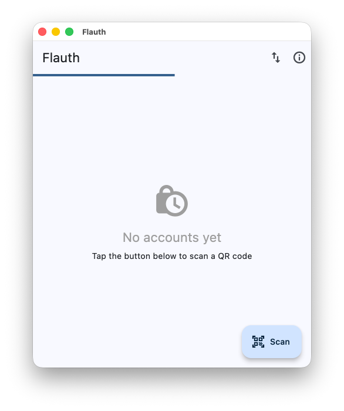
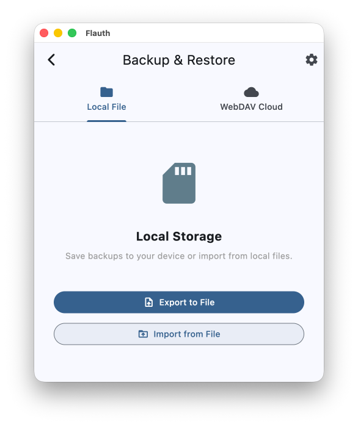
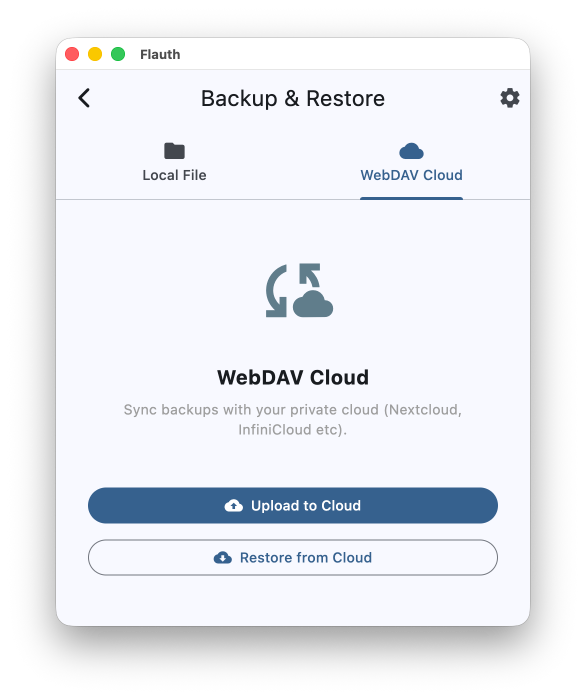
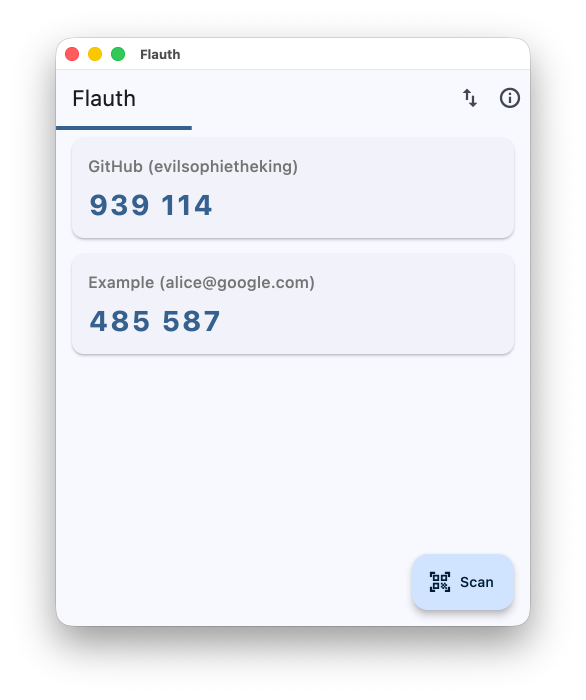

# Flauth 🔐

[English version](./README.md)

Flauth 是一款使用 Flutter 开发的开源 TOTP（基于时间的一次性密码）身份验证器。它旨在提供一个简洁、安全且轻量级的 2FA（双重身份验证）管理方案。

## 🌟 为什么选择 Flauth？

- **完全开源**：代码透明可靠，您的密钥永远不会离开您的设备（除非您选择云同步）。
- **灵活的备份方案**：
  - **本地备份**：支持通过系统文件选择器将账号导出为标准的文本文件，或从本地文件导入。
  - **WebDAV 同步**：支持与您的私有云（如 Nextcloud、坚果云等）进行一键同步，支持自定义远程路径，简洁高效。
- **隐私与安全**：
  - **加密存储**：密钥使用平台原生安全机制（iOS/macOS 的 Keychain，Android 的 Keystore）进行加密存储。
  - **颗粒化存储**：采用“一号一密 (One Key Per Account)”架构，提升数据读写性能与可靠性。
- **现代 UI**：极简设计，基于 Material 3，完美支持深色和浅色模式。

## ✨ 功能特性

- **动态验证码**：生成标准的 6 位 TOTP 验证码，每 30 秒自动刷新。
- **扫码添加**：支持扫描 `otpauth://` 标准二维码快速添加账号（专注扫码，杜绝繁琐）。
- **智能去重**：基于密钥自动识别重复账号，防止同步导致的数据冗余。
- **实时进度条**：直观展示验证码剩余有效时间。
- **便捷操作**：点击复制，滑动删除（带二次确认）。






## 🛠️ 技术栈

- **Flutter & Dart**
- **[Provider](https://pub.dev/packages/provider)**: 状态管理。
- **[OTP](https://pub.dev/packages/otp)**: 核心算法实现。
- **[Flutter Secure Storage](https://pub.dev/packages/flutter_secure_storage)**: 安全数据持久化。
- **[Mobile Scanner](https://pub.dev/packages/mobile_scanner)**: 二维码识别。
- **[http](https://pub.dev/packages/http)**: 轻量级 WebDAV 实现。

## 🚀 快速开始

### 前置条件
- 已安装 [Flutter SDK](https://docs.flutter.dev/get-started/install)
- 对应的开发环境 (Android Studio / Xcode)

### 安装步骤

1. 克隆并进入项目目录：
   ```bash
   git clone https://github.com/jiacai2050/flauth.git
   cd flauth
   ```

2. 安装依赖：
   ```bash
   flutter pub get
   ```

3. 运行应用：
   ```bash
   flutter run
   ```

## 🏗️ 平台适配说明

### macOS
在 macOS 上构建时，请确保在 Xcode 中配置了 **Development Team** 进行代码签名（访问 Keychain 必须）。应用已配置以下沙盒权限：
- 网络客户端 (WebDAV 同步)
- 摄像头 (扫码添加)
- 钥匙串共享 (安全存储)
- 用户选择文件访问 (本地备份)

## 🛡️ 权限说明

- **相机**：用于扫描二维码添加账号。
- **存储/网络**：用于本地文件备份或 WebDAV 云端同步。

## 📄 开源协议

本项目采用 [MIT 协议](https://liujiacai.net/license/MIT)。
