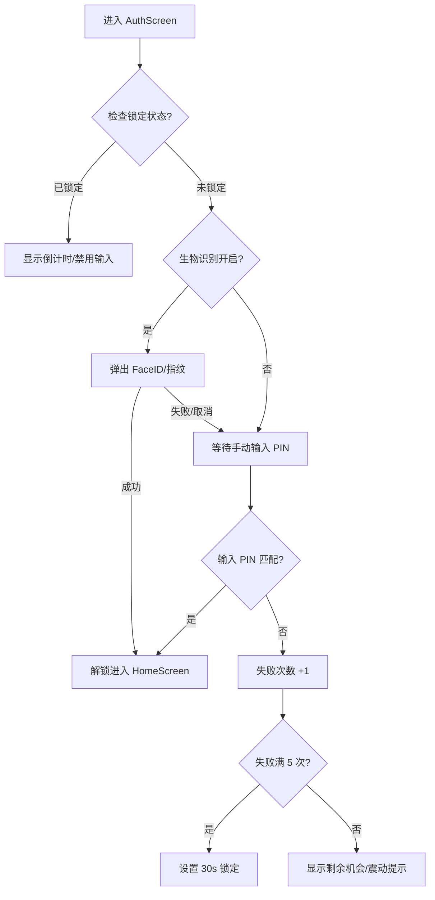

# Flauth 身份验证架构说明

本文档详细描述了 Flauth 的安全实现机制，包括 PIN 码保护、生物识别集成及其交互逻辑。

## 1. 核心安全策略：双重防护 (Two-Tier Protection)

Flauth 采用的是**应用级独立验证**结合**系统级生物识别**的方案。

*   **一级验证（生物识别）**：利用 `local_auth` 插件调用 iOS (FaceID/TouchID) 或 Android (指纹/人脸)。
    *   **限制**：开启了 `biometricOnly: true`。这意味着生物识别失败或取消时，系统**不会**弹出手机锁屏密码作为后备，而是直接退回到应用的 PIN 码界面。
*   **二级验证（自定义 PIN 码）**：由应用自身维护的 4 位数字密码。这是**核心兜底机制**，建立了独立的防御边界。

## 2. 存储设计 (Storage Service)

所有敏感信息均存储在 `flutter_secure_storage` 中：

*   **auth_pin**: 存储用户设置的 PIN 码。
*   **auth_biometric_enabled**: 布尔值，标记用户是否授权使用生物识别。
*   **auth_failed_attempts**: 连续输入错误的次数。
*   **auth_lockout_end**: 锁定结束的 ISO8601 时间戳。
*   **auth_pin_skipped**: 标记用户是否选择了跳过初始设置。

## 3. 身份验证流程

### 3.1 启动与锁定逻辑
1.  **初始化**：`AuthProvider` 检查 `auth_pin` 存在性及锁定状态。
2.  **锁定检查**：若当前时间早于 `auth_lockout_end`，则 UI 禁用输入并显示倒计时。
3.  **自动识别**：若未被锁定且开启了生物识别，`AuthScreen` 自动弹出验证框。

### 3.2 验证路径与防爆破

## 4. 安全特性

*   **隔离性**：不复用手机锁屏密码，即使手机密码泄露，2FA 令牌依然安全。
*   **防爆破 (Anti-Brute Force)**：连续 5 次错误输入强制锁定 30 秒，锁定状态持久化，重启应用无法重置。
*   **防泄露**：`AuthScreen` 作为遮罩，验证通过前内存中不解密 TOTP 密钥。
*   **强制生物识别**：通过 `biometricOnly` 确保生物验证与 PIN 验证的界限清晰，防止系统级后备逻辑干扰应用安全策略。

## 5. 设计权衡 (Design Trade-offs)

我们选择了“自定义 PIN”而非“复用系统密码”，是为了应对“手机在解锁状态下被抢夺/借用”的风险。虽然这增加了用户的记忆负担，但对于管理账户登录权的验证器应用来说，安全性是第一优先级的。