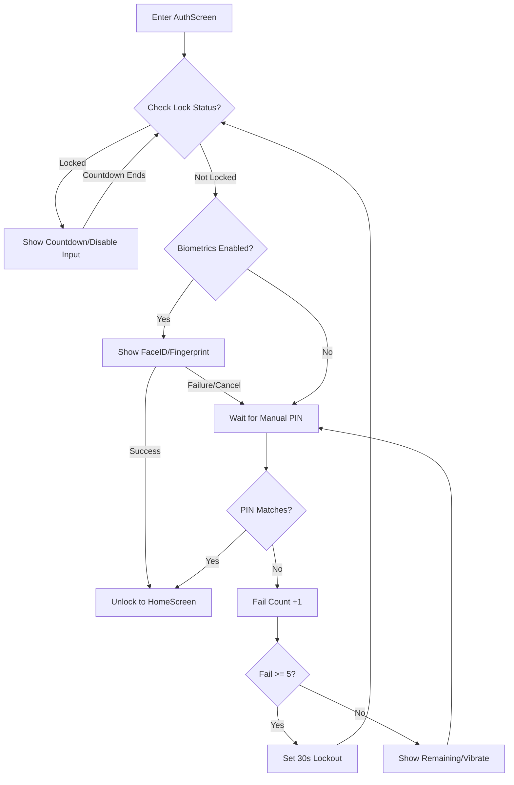

# Flauth Authentication Architecture

This document details the security implementation mechanisms of Flauth, including PIN protection, biometric integration, and interaction logic.

## 1. Core Security Strategy: Two-Tier Protection

Flauth employs a **Application-Level Independent Authentication** combined with **System-Level Biometrics**.

*   **Tier 1 (Biometrics)**: Uses the `local_auth` plugin to invoke iOS (FaceID/TouchID) or Android (Fingerprint/Face).
    *   **Android Implementation**: The host Activity extends `FlutterFragmentActivity` and applies the `Theme.MaterialComponents` theme to ensure perfect compatibility with the system-level `BiometricPrompt`.
*   **Tier 2 (Custom PIN)**: A 4-digit numeric password maintained by the application itself. This is the **core fallback mechanism**, establishing an independent defense boundary.

## 2. Storage Design (Storage Service)

All sensitive information is stored in `flutter_secure_storage` (using encrypted Shared Preferences/Keystore on Android and Keychain on iOS):

*   **auth_pin**: Stores the user-set PIN.
*   **auth_biometric_enabled**: Boolean, marks whether the user has authorized biometric use.
*   **auth_failed_attempts**: Number of consecutive incorrect entries.
*   **auth_lockout_end**: ISO8601 timestamp for when the lockout ends.
*   **auth_pin_skipped**: Marks whether the user chose to skip the initial setup.

## 3. Authentication Flow

### 3.1 Startup & Lifecycle Management
1.  **Initialization**: `AuthProvider` checks the existence of `auth_pin` and the lockout status.
2.  **Lock Check**: If the current time is earlier than `auth_lockout_end`, the UI disables input and shows a countdown.
3.  **Auto-Auth**: If not locked and biometrics are enabled, `AuthScreen` automatically pops up the verification dialog after the first frame is rendered.
4.  **Background Auto-Lock**:
    *   When the app enters the background, the current timestamp is recorded.
    *   When the app returns to the foreground, it checks the duration of absence. If the absence exceeds the **30-second Grace Period**, the app forces a switch back to the unauthorized state, requiring re-authentication.

### 3.2 Verification Path & Anti-Brute Force

## 4. Platform Compatibility

*   **Android**:
    *   **Minimum Supported Version**: Android 9.0 (SDK 28).
    *   **Build Config**: Uses Java 11 and modern Kotlin compiler configuration.
    *   **Theming**: Uses Material Components theme architecture (`LaunchTheme` and `NormalTheme` both extend `Theme.MaterialComponents`) to ensure consistent and stable fingerprint dialog styles across various device brands.
*   **iOS**:
    *   Uses standard FaceID/TouchID authentication.
*   **Desktop**:
    *   Currently only supports PIN authentication.

## 5. Security Features

*   **Isolation**: Does not reuse the phone's lock screen password. Even if the phone password is compromised, the 2FA tokens remain secure.
*   **Anti-Brute Force**: 5 consecutive incorrect entries force a 30-second lockout. The lockout state is persisted and cannot be reset by restarting the app.
*   **Leak Prevention**: `AuthScreen` acts as an overlay; TOTP secrets are not decrypted in memory until verification passes.
*   **Lifecycle Awareness**: Uses `WidgetsBindingObserver` to monitor app state in real-time, preventing content from being viewed when the app is in the background.

## 6. Design Trade-offs

We chose a "Custom PIN" over "Reusing System Password" to address the risk of "Phone being snatched/borrowed while unlocked". Although this increases the memory burden on the user, for an authenticator app managing account access rights, security is the primary priority. At the same time, the introduction of the **30-second background grace period** balances security with the usability of frequent app switching.
