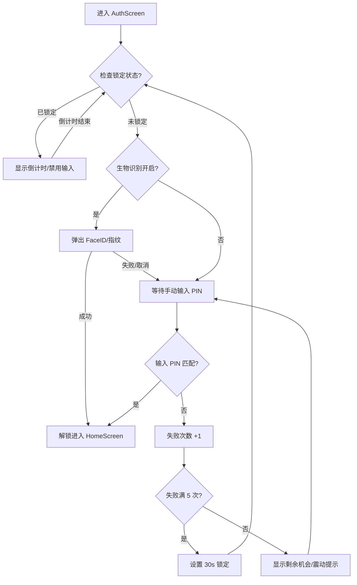

# Flauth 身份验证架构说明

本文档详细描述了 Flauth 的安全实现机制，包括 PIN 码保护、生物识别集成及其交互逻辑。

## 1. 核心安全策略：双重防护 (Two-Tier Protection)

Flauth 采用的是**应用级独立验证**结合**系统级生物识别**的方案。

*   **一级验证（生物识别）**：利用 `local_auth` 插件调用 iOS (FaceID/TouchID) 或 Android (指纹/人脸)。
    *   **Android 实现**：宿主 Activity 继承自 `FlutterFragmentActivity`，并应用 `Theme.MaterialComponents` 主题，以确保对系统级 `BiometricPrompt` 的完美兼容。
*   **二级验证（自定义 PIN 码）**：由应用自身维护的 4 位数字密码。这是**核心兜底机制**，建立了独立的防御边界。

## 2. 存储设计 (Storage Service)

所有敏感信息均存储在 `flutter_secure_storage` 中（Android 端使用加密的 Shared Preferences/Keystore，iOS 端使用 Keychain）：

*   **auth_pin**: 存储用户设置的 PIN 码。
*   **auth_biometric_enabled**: 布尔值，标记用户是否授权使用生物识别。
*   **auth_failed_attempts**: 连续输入错误的次数。
*   **auth_lockout_end**: 锁定结束的 ISO8601 时间戳。
*   **auth_pin_skipped**: 标记用户是否选择了跳过初始设置。

## 3. 身份验证流程

### 3.1 启动与生命周期管理
1.  **初始化**：`AuthProvider` 检查 `auth_pin` 存在性及锁定状态。
2.  **锁定检查**：若当前时间早于 `auth_lockout_end`，则 UI 禁用输入并显示倒计时。
3.  **自动识别**：若未被锁定且开启了生物识别，`AuthScreen` 在首帧渲染后自动弹出验证框。
4.  **后台自动锁定**：
    *   应用进入后台时，会记录当前时间戳。
    *   应用恢复前台时，会检查离开时长。若离开超过 **30 秒（Grace Period）**，应用将强制切回未授权状态，要求重新验证。

### 3.2 验证路径与防爆破

## 4. 平台兼容性

*   **Android**:
    *   **最低支持版本**: Android 9.0 (SDK 28)。
    *   **构建配置**: 采用 Java 11 与 Kotlin 现代编译器配置。
    *   **主题方案**: 采用 Material Components 主题架构（`LaunchTheme` 与 `NormalTheme` 均继承自 `Theme.MaterialComponents`），确保指纹识别对话框在各品牌手机上的样式一致性与稳定性。
*   **iOS**:
    *   使用标准的 FaceID/TouchID 认证。
*   **桌面端**:
    *   目前仅支持 PIN 码验证。

## 5. 安全特性

*   **隔离性**：不复用手机锁屏密码，即使手机密码泄露，2FA 令牌依然安全。
*   **防爆破 (Anti-Brute Force)**：连续 5 次错误输入强制锁定 30 秒，锁定状态持久化，重启应用无法重置。
*   **防泄露**：`AuthScreen` 作为遮罩，验证通过前内存中不解密 TOTP 密钥。
*   **生命周期感知**：通过 `WidgetsBindingObserver` 实时监听应用状态，防止应用切到后台后内容被窥视。

## 6. 设计权衡 (Design Trade-offs)

我们选择了“自定义 PIN”而非“复用系统密码”，是为了应对“手机在解锁状态下被抢夺/借用”的风险。虽然这增加了用户的记忆负担，但对于管理账户登录权的验证器应用来说，安全性是第一优先级的。同时，通过引入 **30 秒后台宽限期**，平衡了安全性和频繁切换应用的易用性。